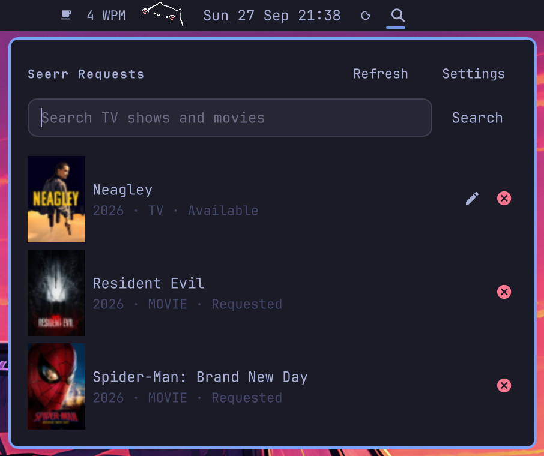

# Seerr Quick Requests

An Omarchy Quattro bar popup for quickly requesting TV shows and movies from [Seerr](https://docs.seerr.dev/).



## Install from the Omarchy Plugin Store

```sh
omarchy plugin install spicybackend.seerr
omarchy plugin enable spicybackend.seerr
```

Or install directly from GitHub:

```sh
omarchy plugin add https://github.com/spicybackend/omarchy-seerr.git --enable
```

The plugin adds a **Seerr** icon to the bar. Move it if needed:

```sh
omarchy bar move spicybackend.seerr --section center
```

Click the bar icon or press the hotkey to open the popup.

## Hotkey

Add to `~/.config/hypr/bindings.conf` (or your Omarchy user keybinding file):

```ini
bind = SUPER SHIFT ALT, R, exec, omarchy-shell shell toggle spicybackend.seerr '{}'
```

Reload Hyprland configuration after adding the binding.

## Setup

1. Open the popup and click **Settings**.
2. Enter your Seerr instance URL and API key.
   - Create the API key in **Seerr → Settings → General**.
3. Choose how to save the key:
   - **Save in keyring** (recommended): stores the key in the desktop Secret Service, protected by your login keyring.
   - **Use this session only**: keeps the key in memory until the shell exits.
4. The instance URL is saved and prefilled next time.

Use **Settings → Sign out** to remove the saved key.

## Features

- View requested TV shows and movies with availability status.
- Search across TV and movies with poster thumbnails and release years.
- Request movies instantly.
- Request TV shows with a season picker: **First**, **Latest**, **All**, or a custom selection.
- Edit existing TV requests to change selected seasons.
- Remove a request, with an optional toggle to also delete files from Sonarr/Radarr (requires ADMIN permission on the API key).
- Reacts to Omarchy theme changes automatically.

## Notes

- This is a third-party Omarchy Quattro plugin (`manifest.json` schema v1).
- Seerr enforces the API key's permissions and quotas.
- Local email/password sign-in is not supported; use an API key.

## Attributions

The Seerr icon used in the bar widget is from the [Seerr](https://github.com/seerr-team/seerr) project and is used under its MIT license.

## License

MIT
